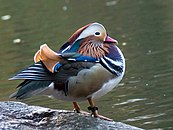

---
# Set the title shown in a browser's tab bar
pagetitle: Template presentation
---

## Template presentation

::: notes

- Put any slide notes here.
- Press `s` to view them in the browser.
:::

## Auto animation {data-auto-animate=""}

- Add the `{date-auto-animate=""}` tag to adjacent slides to automatically
  animate elements across slides

## Auto animation {data-auto-animate=""}

### A duck



## Syntax highlighting

Python:

```python
def hello_world():
    print('Hello, world!')
```

C:

```C
#include <stdio.h>

int main(void) {
    printf("Hello, world!\n");
}
```

## Maths with LaTeX

$$ \pi r^2 $$

$$
\label{eq:continuous-fraction-sqrt}
\sqrt{S} = c + \cfrac{r} {2c
             + \cfrac{r} {2c
             + \cfrac{r} {2c
             + \cfrac{r} {2c
             + \cfrac{r} {2c
             + \dots
}}}}}
$$
